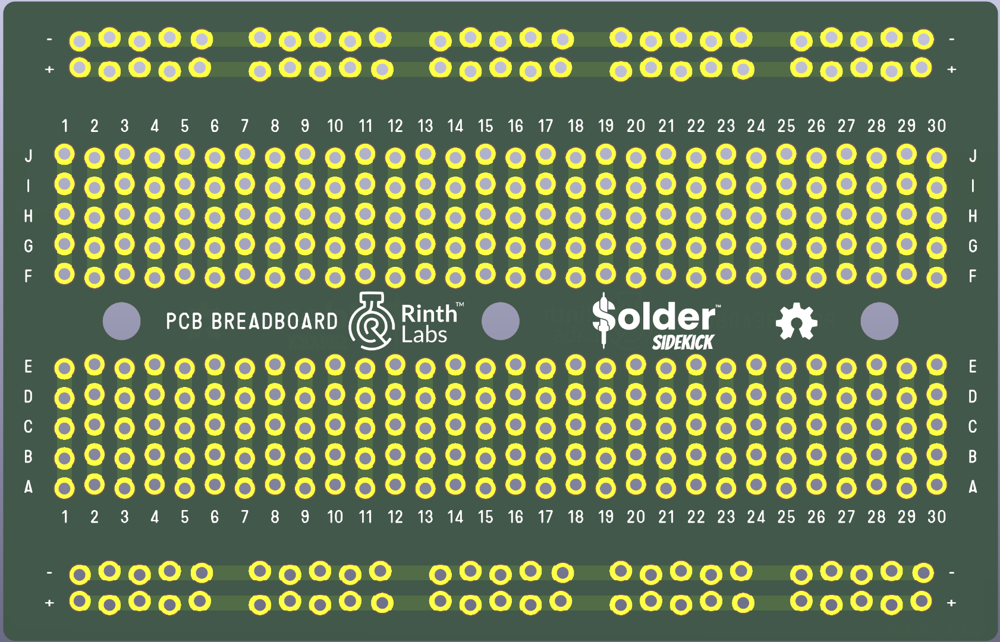

# PCB breadboard for Solder Sidekick – Based on Soldered Electronics Design

This repository contains a modified version of the **PCB breadboard/protoboard** by [Soldered Electronics](https://www.soldered.com), reused with permission under the **TAPR Open Hardware License (OHL v1.0)**.

We’re using this board design as a **demonstration platform** for the [Solder Sidekick](https://soldersidekick.com) — an open hardware kit that converts an Ender 3 3D printer into a hands-free through-hole soldering robot.

## ✅ Modifications & Attribution

We’ve made the following changes:

- Replaced the original silkscreen logo with the **Solder Sidekick** branding
- Replaced footprints with offset ["locking pins"](https://web.archive.org/web/20241003224515/https://www.sparkfun.com/tutorials/114)
- Exported gerber files and drill files

See [`Change Log.xlsx`](./CAD/Change%20Log.xlsx) for a detailed list of changes.

All original copyrights and license information are preserved.  
The original version of this README is archived as [`README_original.md`](./README_original.md).

## 📎 License

This project is licensed under the [TAPR Open Hardware License v1.0](./LICENSE.md).  
All modifications are also released under the same license.

## 🙏 Credit

Original design by **Soldered Electronics**  
Visit their site for more great open hardware: [https://www.soldered.com](https://www.soldered.com)

---

## ℹ️ More Info

Learn more about the Solder Sidekick project at:  
🌐 [https://soldersidekick.com](https://soldersidekick.com)

Have fun, and keep it open!
